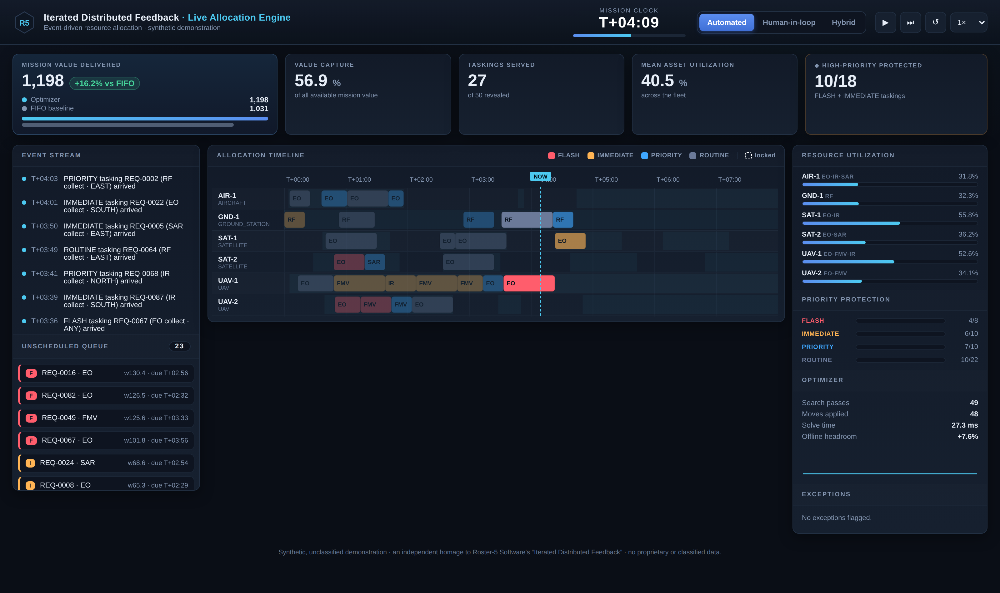
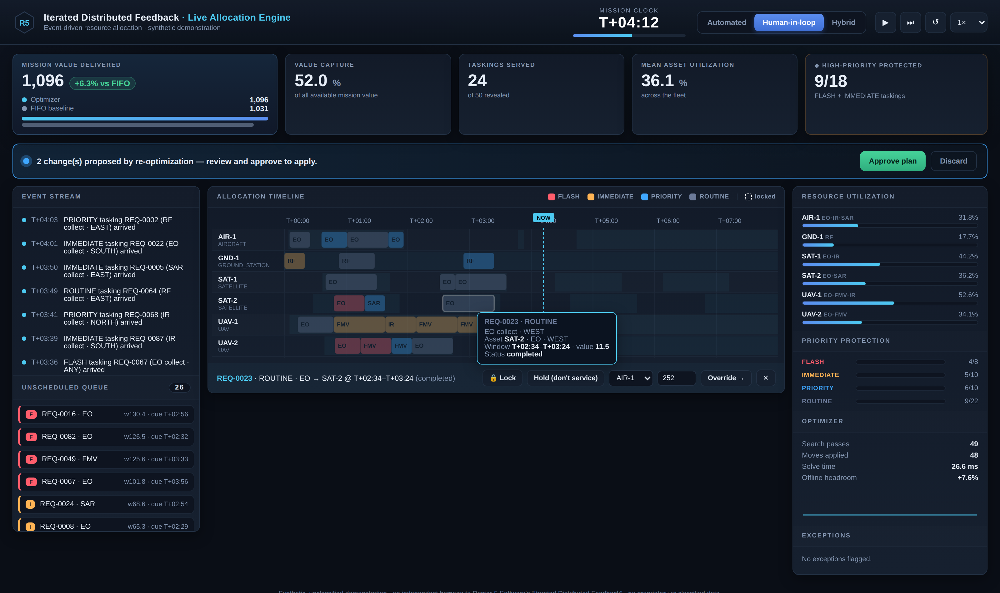
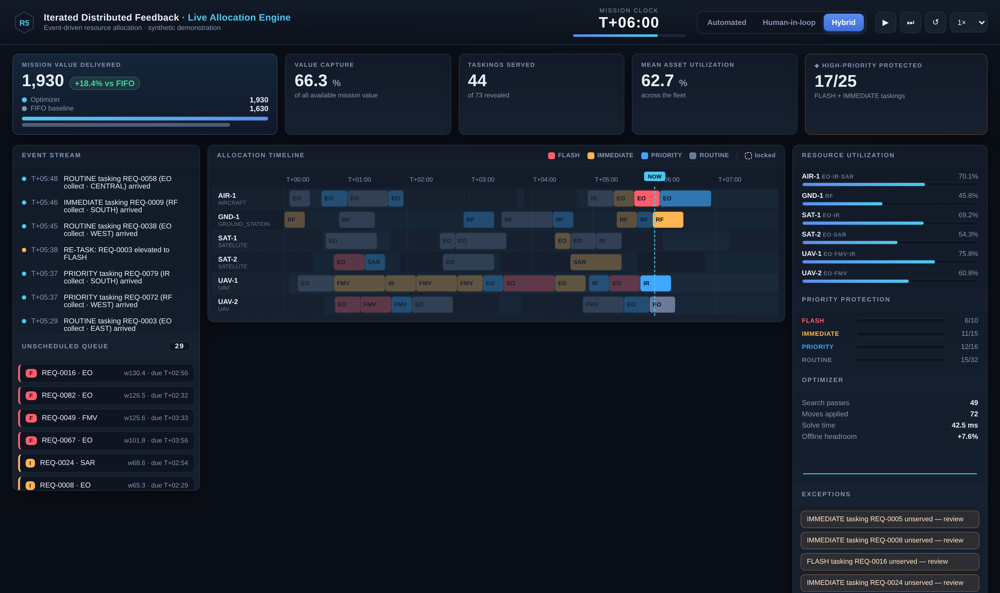
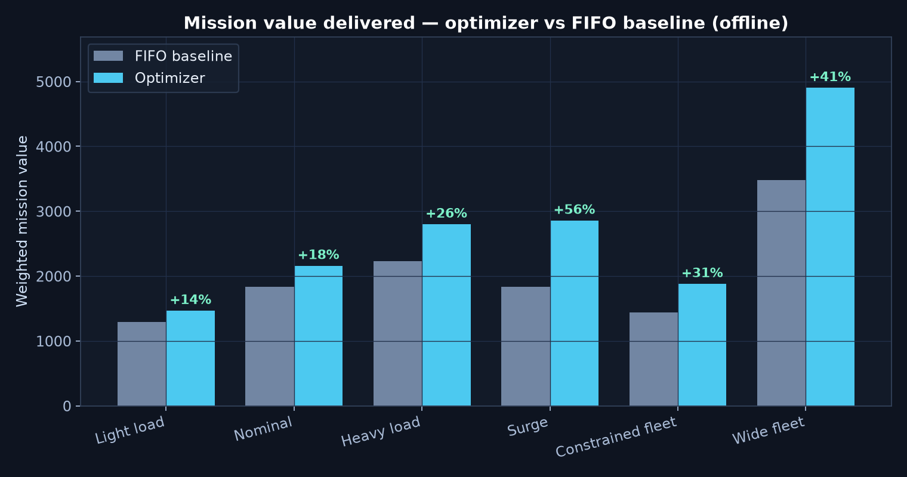
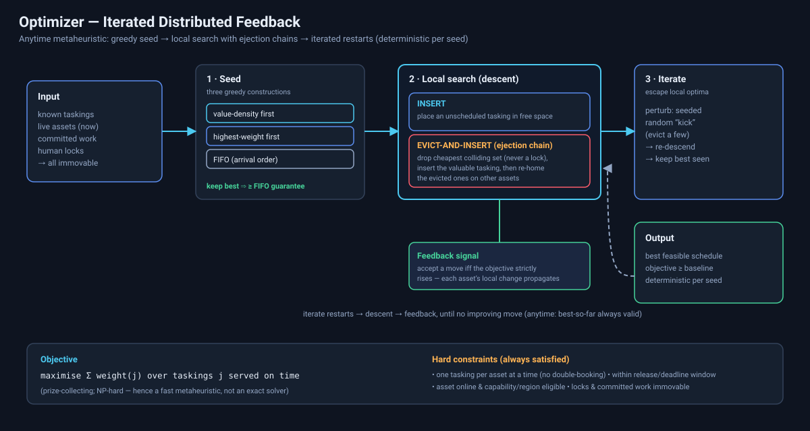
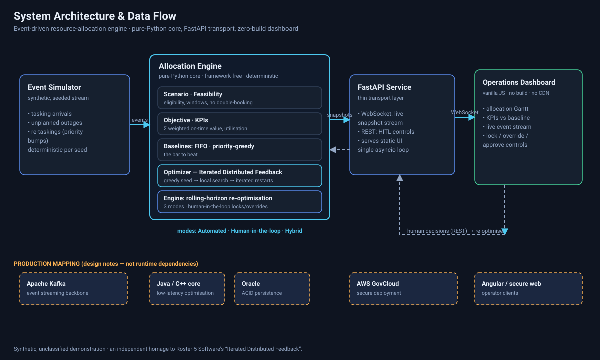

# Event-Driven Resource-Allocation Engine

**A real-time scheduler that allocates a stream of prioritised, deadline-bound taskings to a
limited pool of assets — automatically, with a human in the loop, or hybrid — with a live
operations dashboard that shows it working.**

An independent, unclassified **homage to Roster-5 Software's flagship "Iterated Distributed
Feedback"** algorithm, built on entirely synthetic data. It runs on a normal laptop with
**nothing but Python** — no Node, no build step, no database server, no cloud.

> Roster-5 describes its algorithm as building "'best-known' quality solutions in a handful of
> seconds" and running "fully-automated closed-loop, with human inputs, or … hybrid." This
> project reproduces that shape end-to-end on a tasteful civilian analogue of a sensor-tasking /
> collection-management problem.

---

## ⭐ For non-engineers — look here first (no setup required)

Everything impressive is visible **without running anything**:

| Open this | What it shows |
|---|---|
| 🔆 **[`report.html`](report.html)** | **Start here.** A single self-contained page (just double-click it) — the whole story: value, the live system, and how it works. |
| 🖼️ [`artifacts/screenshots/`](artifacts/screenshots/) | Real screenshots of the running dashboard in all three modes. |
| 📊 [`benchmarks/results/`](benchmarks/results/) | Charts proving the value (e.g. mission value vs. the naive baseline). |
| 🧭 [`diagrams/`](diagrams/) | System architecture and the algorithm, as diagrams. |

**The 30-second version:** imagine far more requests for satellites, drones, and sensors than
you have assets to cover, each with a priority and a deadline, and the picture changing every
minute. This engine continuously decides *which asset does which task, when*, to deliver the most
mission value — and lets an operator step in to lock, override, or approve decisions. Across six
test scenarios it delivered **+31% more mission value on average** (up to +56%) than the naive
first-come-first-served approach.

### The live dashboard



| Human-in-the-loop | Hybrid (exceptions surfaced) |
|---|---|
|  |  |

### The proof of value



---

## Prerequisites

- **Python 3.11 or newer.** That's it. (Check with `python3 --version`.)
- macOS, Linux, or Windows. ~Modest resources (runs comfortably in well under 1 GB RAM).

No Node.js, no compiler, no database, no internet connection required to run it.

## Install & run (copy-paste)

```bash
# from the repository root:
./run.sh
```

`run.sh` creates a virtual environment, installs the two runtime dependencies (FastAPI +
uvicorn), and starts the dashboard. Then open **http://127.0.0.1:8000**.

<details>
<summary>Prefer to do it by hand?</summary>

```bash
python3 -m venv .venv
source .venv/bin/activate          # Windows: .venv\Scripts\activate
pip install -r requirements.txt
python -m app                      # serves http://127.0.0.1:8000
```
</details>

## Try each of the three modes

The dashboard boots in **Automated** mode and starts playing a simulated 8-hour shift. Use the
mode switch in the top-right to explore:

1. **Automated** — fully automated closed loop. The optimiser re-plans on every event (a new
   tasking, an unplanned asset outage, a re-tasking) and applies the new plan immediately. Watch
   the "mission value delivered" KPI stay ahead of the live FIFO baseline.
2. **Human-in-the-loop** — click **Human-in-loop**. Now re-optimised plans wait for your
   approval (a banner appears). Click any block on the timeline to **lock**, **override** (force
   onto a specific asset/time), or **hold** (decline) a tasking; the engine re-plans around your
   decision.
3. **Hybrid** — automated by default, but high-impact exceptions (e.g. an unserved FLASH/IMMEDIATE
   tasking) are surfaced in the **Exceptions** panel for you to notice.

Playback controls (play/pause, single-step, restart, speed) are in the top-right. The whole
shift replays in about half a minute at the default speed.

---

## How it works (the short version)

The scheduling problem is *weighted, prize-collecting interval scheduling on unrelated parallel
machines with release times, deadlines, and eligibility constraints* — **NP-hard**, so a fast
**anytime metaheuristic** beats an exact solver in real time. The optimiser:

1. **Seeds** three greedy constructions (value-density, weight, FIFO) and keeps the best — which
   also *guarantees it never scores below the FIFO baseline*.
2. **Local search** with two moves: `INSERT` (fill free time) and `EVICT-AND-INSERT` — an
   **ejection chain** that drops the cheapest colliding taskings to make room for a more valuable
   one, then re-homes the evicted work elsewhere (never disturbing a human lock).
3. **Iterates** — a seeded random "kick" escapes local optima; the best result is kept. A fixed
   seed makes the whole thing **deterministic**.

The **engine** wraps this in an event-driven, rolling-horizon loop: in-progress work is immutable,
human locks/overrides are hard constraints, and every event triggers a re-optimisation of the
remaining horizon.



See [`docs/RESEARCH_BRIEF.md`](docs/RESEARCH_BRIEF.md) for the full problem framing and citations,
and [`docs/PRODUCTION_MAPPING.md`](docs/PRODUCTION_MAPPING.md) for how each layer maps to
Roster-5's production stack (Java/C++ · Kafka · Oracle · AWS).

## Architecture

A pure-Python optimisation core (no framework coupling, fully tested) behind a thin FastAPI
transport and a zero-build dashboard.



```
app/
  core/         # pure-Python domain + algorithm (no web framework imported here)
    models.py        # domain types (Resource, Request, Allocation, Schedule, Scenario, …)
    feasibility.py   # eligibility, placement rules, the validation oracle
    objective.py     # objective function + operational KPIs
    construct.py      # shared greedy constructor
    baseline.py      # FIFO + priority-greedy baselines
    optimizer.py     # the optimiser — Iterated Distributed Feedback (the centrepiece)
    scenario.py      # synthetic, seeded scenario + event-stream generator
    engine.py        # event-driven orchestration, three modes, human-in-the-loop
  api/          # FastAPI: WebSocket stream + REST control + static hosting
  static/       # vanilla HTML/CSS/JS dashboard (no build, no CDN)
benchmarks/     # proof-of-value suite + committed charts
diagrams/       # programmatic SVG diagram generator + committed SVGs
scripts/        # screenshot capture + report.html generator
tests/          # unit + property-based (Hypothesis) + API integration tests
docs/           # research brief + production mapping
```

## Testing & quality

```bash
pip install -r requirements-dev.txt
pytest            # 55 tests: unit + property-based (Hypothesis) + API integration
ruff check .      # lint — clean
mypy              # static types (strict) — clean
```

The property-based tests assert the optimiser's invariants on thousands of random instances:
no asset is ever double-booked, every constraint is respected, and the objective is **never below
the baseline** — deterministically, for any seed.

## Regenerating the artifacts (optional)

The charts, diagrams, screenshots, and `report.html` are committed, so you never need to. To
rebuild them:

```bash
pip install -r requirements-dev.txt
playwright install chromium      # one-time, for the screenshots (needs internet)
bash scripts/make_artifacts.sh
```

## A note on integrity

This is a **synthetic, unclassified demonstration**. It contains no proprietary or classified
data and reveals nothing about Roster-5's actual systems. The scenario is an invented, civilian
analogue; "Iterated Distributed Feedback" is reproduced *in spirit* from Roster-5's public
description and the open task-allocation literature (Contract-Net, CBBA, iterated local search),
not from any internal knowledge.

## License

MIT — see [`LICENSE`](LICENSE).
